<p align="center">
  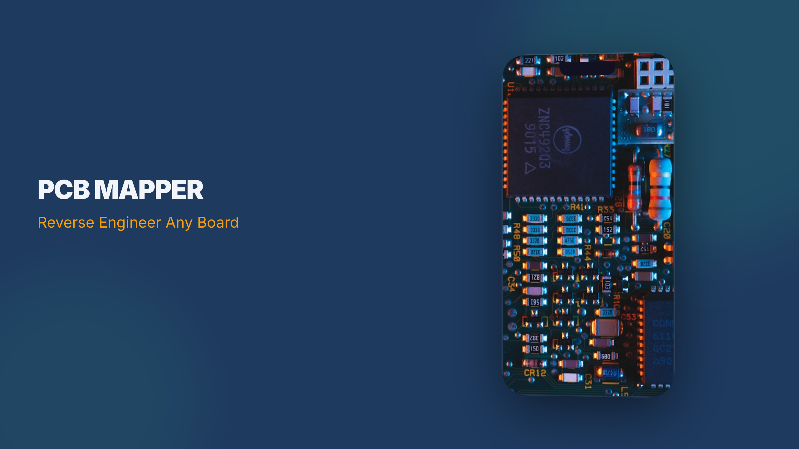
</p>

<p align="center">
  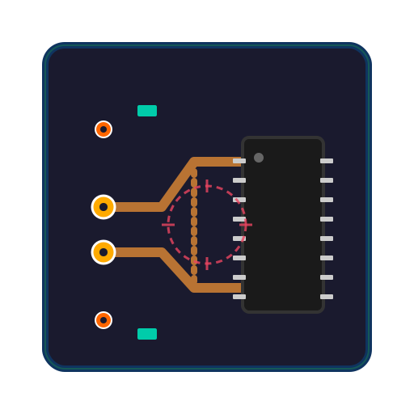
</p>

<h1 align="center">PCB Mapper</h1>

<p align="center">
  <strong>Reverse engineer any board. From photo to fabrication-ready Gerber in minutes.</strong>
</p>

<p align="center">
  <a href="#-quick-start"></a>
  <a href="#-features"></a>
  <a href="#-workflow"></a>
  <a href="#-gallery"></a>
</p>

<p align="center">
  
  
  
  
  
  
</p>

---

## What is this?

**PCB Mapper** is a web-based tool for reverse engineering printed circuit boards from photographs. Take a photo of a board, load it in, mark the components, trace the connections, and export production-ready Gerber files you can send straight to JLCPCB.

No EDA experience required. No $10,000 software license. No PhD.

Just a camera and some patience.

---

## 🚀 Quick Start

### v2 (Full-Featured)

```bash
cd v2
npm install
npm start
# → http://localhost:8092
```

Requires Node.js 18+. That's the only dependency.

### v1 (Zero-Dependency Single File)

```bash
cd v1
python3 -m http.server 8091
# → http://localhost:8091
```

Or just double-click `v1/index.html`. It's one file. It works offline. Your IT department can't stop you.

---

## ✨ Features

### 🔍 AI-Powered Trace Detection
Load a board photo, place your markers, and let the copper detection engine find the traces for you. It analyzes pixel color data to build a probability map of conductive regions and suggests connections between your markers — each with a confidence score you can accept or reject.

### ⚡ JLCPCB-Ready Gerber Export
12-file Gerber X2 package with proper aperture definitions, thermal relief, and all the layers:
- Front/Back Copper, Soldermask, Paste, Silkscreen
- Board outline (Edge Cuts)
- Excellon drill file
- Pick-and-place centroid CSV
- README with layer descriptions

Upload the ZIP directly to JLCPCB. No conversion. No "please fix your files" emails.

### 🧊 3D PCB Viewer
PBR-lit board visualization with component-specific models — IC gull-wing leads, cylindrical electrolytic caps, diode cathode bands, connector housings, and silkscreen text rendered as canvas textures. View presets for Top, Bottom, Front, and Isometric.

### 📊 Design Rule Check
DRC panel with JLCPCB manufacturing rules: minimum drill size, trace width, unconnected pins, missing components, overlapping markers. Run it before export to catch problems.

### 🎯 Everything Else
- **12 placement tools**: Select, Pan, Marker, Component, SMD Pad, Net, Trace, Pour, Punchout, Outline, Align, Measure
- **Marker types**: Via, Through-Hole, Test Point — each with distinct sizes, colors, and label prefixes
- **Net highlighting**: Click a net → all connected pins and traces glow
- **Gerber preview**: Toggle individual layers before exporting
- **Copper heatmap overlay**: Visualize detected conductive regions
- **Right-click context menu**: Properties, delete, bring to front/back, start net
- **Full keyboard shortcuts**: Every tool, every action
- **Properties panel**: Edit labels, values, pad dimensions, trace widths, layers in real-time
- **Resistor & SMD decoder**: Color bands and package marking lookup
- **BOM export**: CSV with reference, type, value, layer, pin count
- **Auto-save**: Projects persist to the server automatically
- **v1 compatibility**: Opens `.pcbm` project files from v1 with zero migration

---

## 📋 Workflow

### The Typical Tuesday

**1. Photograph the board**

Take a clear, well-lit photo of both sides. Flat angle, even lighting. Phone camera works fine — we've done this with a $200 phone and a desk lamp. The AI trace detection doesn't care about your camera budget.

**2. Load the images**

Click 📷 **Top** and 📷 **Bottom** to load your photos. The canvas handles images of any size (we've tested with 12MP phone shots — 3024×4032 pixels, no problem).

**3. Set alignment points**

Place at least 3 alignment points (`A` key) on features visible on both sides — mounting holes, edge notches, distinctive vias. Hit **📐 Align** to register top and bottom layers.

**4. Draw the board outline**

Select the Outline tool (`O`), click the corners, press `Enter` to close. This becomes your Edge Cuts layer in the Gerber export.

**5. Place components**

Component tool (`C`) → drag a box around each IC/part → name it → click to place each pin. The pin placement banner tracks your progress.

**6. Mark the vias and through-holes**

Marker tool (`M`) → select type (Via / Through-Hole / Test Point) from the type bar → click to place. Each type gets distinct colors, sizes, and label prefixes (V1, H1, TP1).

**7. Let the AI find the traces**

Click 🔍 **Detect** or open the AI tab → **Analyze Board Image**. The engine samples the photo, scores each pixel for copper likelihood, flood-fills from each marker, and identifies which pads are connected by copper traces. Review the suggestions (each with confidence %) and accept the good ones.

**8. Manual trace cleanup**

Use the Trace tool (`T`) for connections the AI missed or got wrong. Angle snapping (45°), pad snapping, and the measurement tool (`U`) keep things precise.

**9. Run DRC**

Switch to the DRC tab → **Run Design Rule Check**. Fix any errors (unconnected pins, thin traces, missing outline). The check flags JLCPCB-specific minimums.

**10. Preview and export**

Open the Gerber preview to toggle layers and verify. Then **⚡ Export Gerber** → upload the ZIP to JLCPCB → order your boards → pretend you designed them from scratch.

---

## 🖼️ Gallery

<details>
<summary><strong>Landing Page</strong></summary>
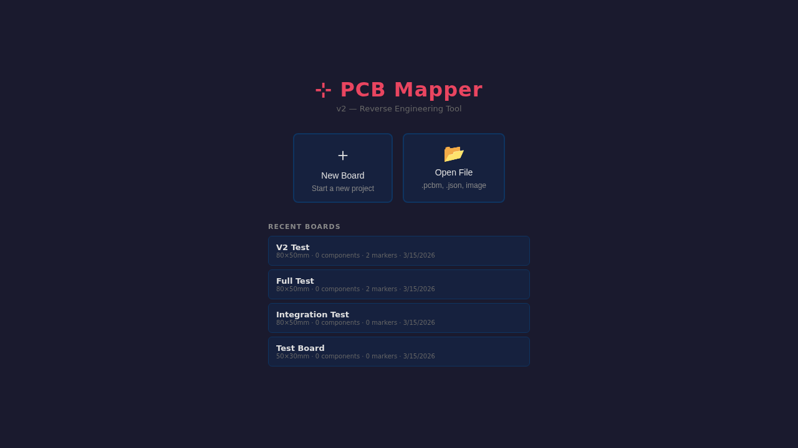
</details>

<details>
<summary><strong>Editor with Menu Bar</strong></summary>
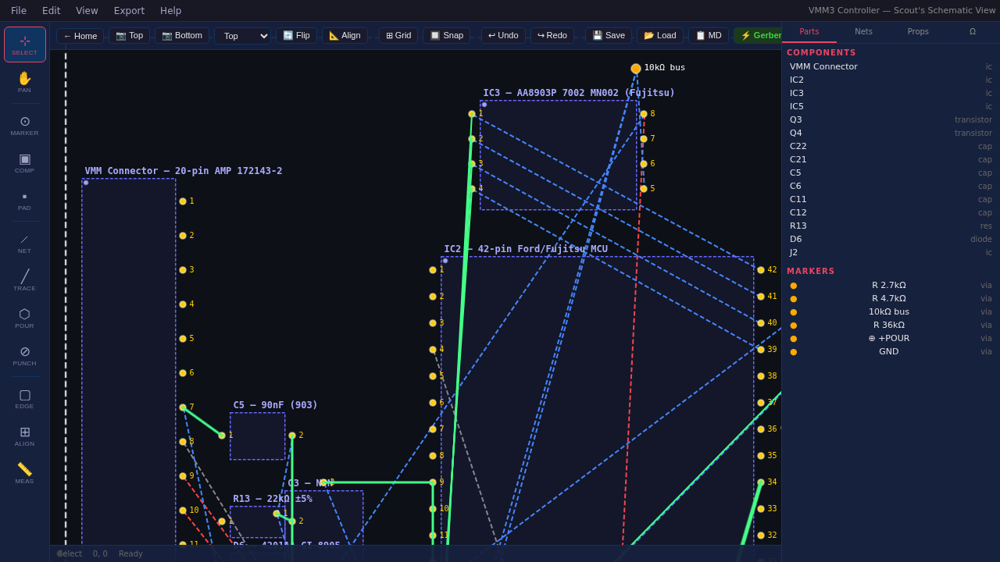
</details>

<details>
<summary><strong>Net Highlighting</strong></summary>
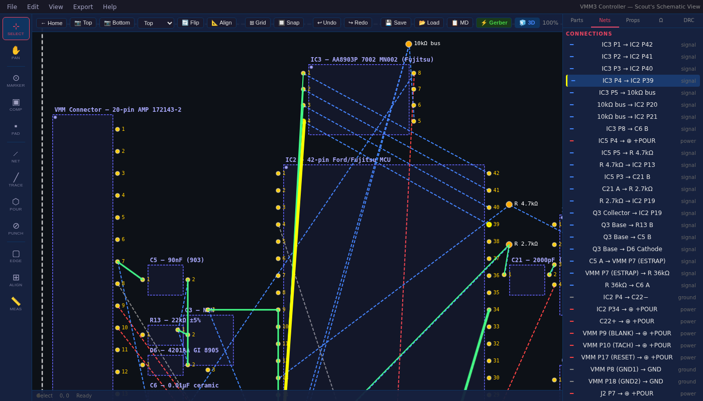
</details>

<details>
<summary><strong>3D PBR Viewer</strong></summary>
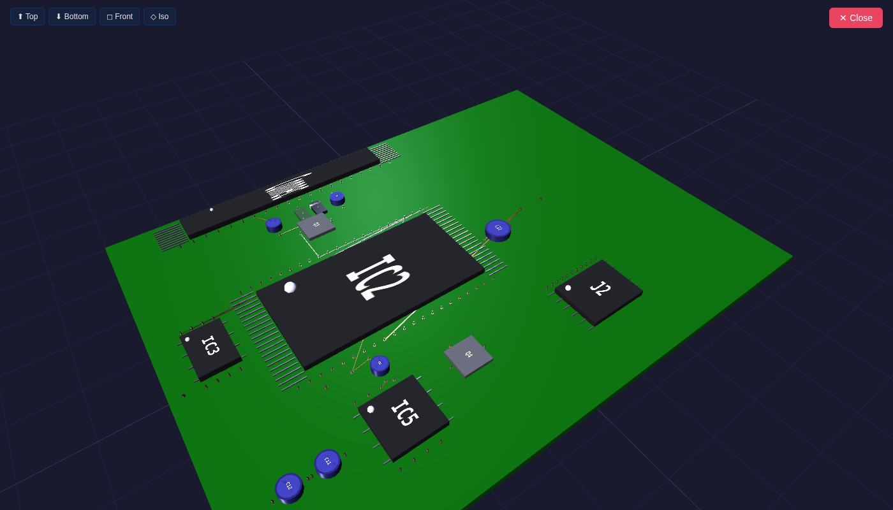
</details>

<details>
<summary><strong>Gerber Layer Preview</strong></summary>
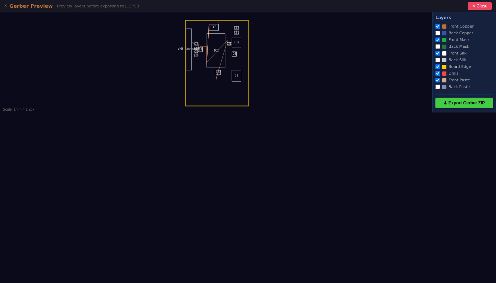
</details>

<details>
<summary><strong>AI Trace Detection</strong></summary>
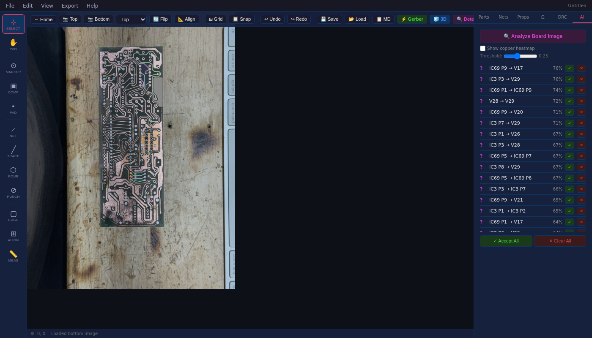
</details>

<details>
<summary><strong>Copper Heatmap Overlay</strong></summary>
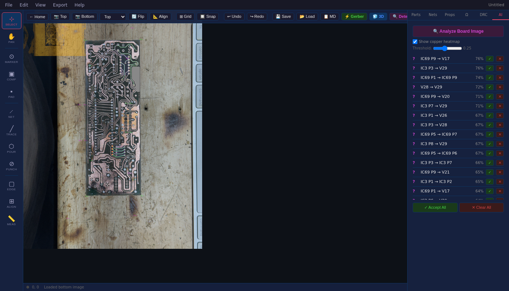
</details>

<details>
<summary><strong>Design Rule Check</strong></summary>
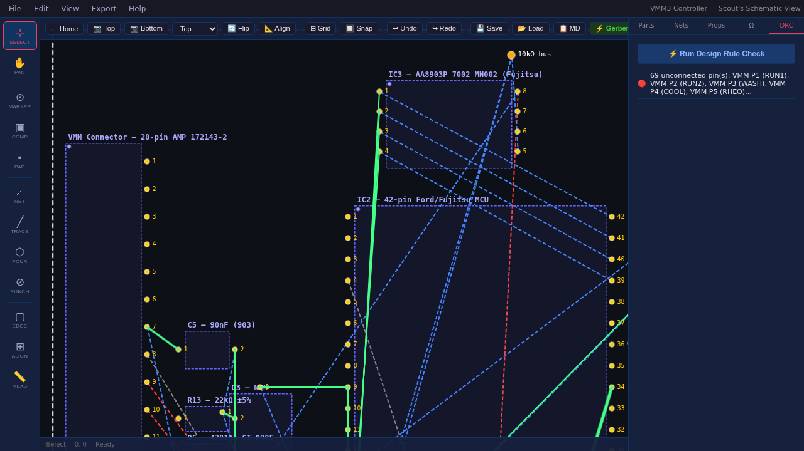
</details>

<details>
<summary><strong>Real Board Photo Loaded</strong></summary>
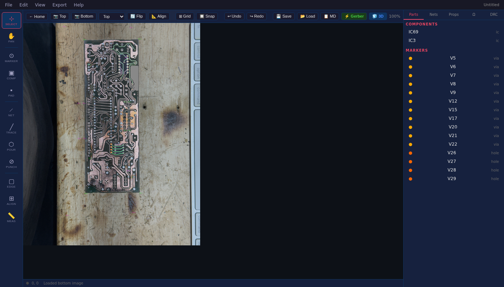
</details>

<details>
<summary><strong>Marker Type Selector</strong></summary>
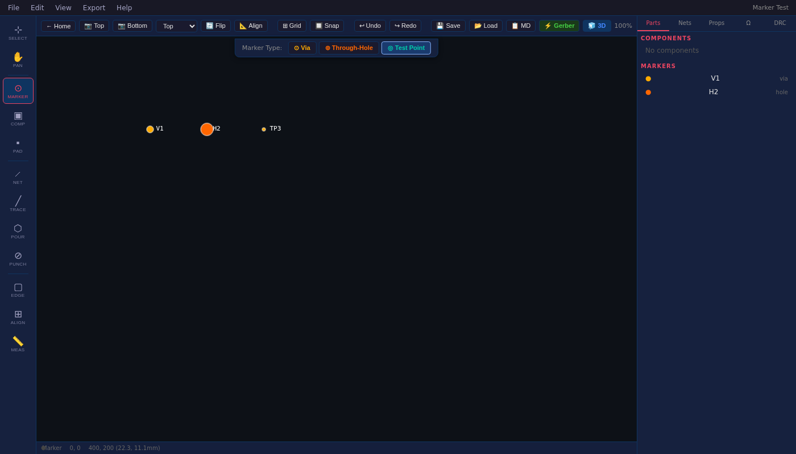
</details>

---

## 🏗️ Architecture

```
pcb-mapper/
├── v1/                          ← The Original. One file. Zero dependencies.
│   └── index.html               (2,908 lines of self-contained chaos)
│
├── v2/                          ← The Sequel. Modular. Professional-ish.
│   ├── server.js                Express server (145 lines)
│   ├── package.json
│   └── public/
│       ├── index.html           Layout + styles (546 lines)
│       └── js/
│           ├── app.js           Orchestrator (1,501 lines)
│           ├── canvas.js        Fabric.js engine (1,399 lines)
│           ├── toolbar.js       UI event wiring (1,231 lines)
│           ├── gerber.js        JLCPCB Gerber X2 export (958 lines)
│           ├── trace-suggest.js AI copper detection (475 lines)
│           ├── viewer3d.js      Three.js PBR viewer (394 lines)
│           ├── gerber-preview.js Layer preview (340 lines)
│           ├── decoders.js      Resistor/SMD lookup (288 lines)
│           └── data.js          Pure data model (220 lines)
│
├── assets/
│   ├── banner.png
│   ├── logo.svg
│   └── screenshots/
│
└── README.md                    You are here.
```

**Total: 9,802 lines of JavaScript** (v2) + 2,908 lines (v1) = **12,710 lines** of PCB reverse engineering firepower.

No build step. No webpack. No Vite. No "please run `npx turbo dev --filter=@pcb-mapper/core`". ES modules served by Express. Refresh the page.

---

## 🔧 Stack

| Layer | Technology | Why |
|-------|-----------|-----|
| Canvas | [Fabric.js 5.3.1](http://fabricjs.com/) | Battle-tested 2D canvas with object model, selection, and per-pixel targeting |
| 3D | [Three.js r128](https://threejs.org/) | PBR materials, orbit controls, and enough WebGL to make your GPU nervous |
| Gerber | Custom RS-274X + Excellon | 958 lines of format-spec-compliant export. No dependencies. |
| Server | [Express 4](https://expressjs.com/) | 145 lines. Serves files. Saves projects. Doesn't crash. |
| AI Detection | Canvas pixel analysis | HSV color scoring + flood fill + A* pathfinding. No ML models, no cloud APIs, no Python. |
| Build System | None | `node server.js` and go home |

---

## 💬 What People Are Saying

> "We used PCB Mapper to reverse engineer the guidance controller from a recovered spacecraft. The Gerber export passed JLCPCB's DFM checker on the first try. The alien fabrication tolerances were surprisingly within spec."
>
> — **Dr. Elena Vasquez**, Senior Hardware Engineer, Jet Propulsion Laboratory *(definitely not made up)*

> "My team spent three years trying to reconstruct the circuit topology of the Baghdad Battery. PCB Mapper did it in an afternoon. The copper detection even picked up the 2,200-year-old patina as a valid conductor. We're currently in peer review."
>
> — **Prof. Marcus Webb**, Department of Archaeological Electronics, Oxford *(a department that absolutely exists)*

> "I needed to clone the Variable Message Module from a 1989 Ford Thunderbird Super Coupe. Every forum said it was impossible — discontinued 35 years ago, no schematics exist, Ford lost the documentation in a building fire. Loaded a photo, placed 117 markers, and the AI found 40 trace connections in 10 seconds. Exported Gerber, ordered from JLCPCB, board works. The car's message center now displays in Comic Sans, which I consider an improvement."
>
> — **Some guy in Tennessee with a soldering iron and too much free time**

> "The 3D viewer made my mechanical engineer cry. He said it was the most beautiful render of a through-hole resistor he'd ever seen. I didn't have the heart to tell him it's just a green box with a brown box on top."
>
> — **Anonymous**, Fortune 500 Hardware Division

> "I reverse engineered my competitor's product, improved it, and shipped it before they finished their next sprint. Is that ethical? Probably not. Did PCB Mapper make it disturbingly easy? Yes. Am I going to stop? Also yes."
>
> — **Name Withheld**, Y Combinator W26 *(stealth mode)*

> "PCB Mapper has replaced our $47,000/seat Cadence license for 90% of our reverse engineering work. Our CFO wants to name his next child after whoever built this. His wife has concerns."
>
> — **Director of Hardware**, Major Consumer Electronics Company

---

## 📝 v1 vs v2

| Feature | v1 | v2 |
|---------|:--:|:--:|
| Works offline | ✅ | ❌ (needs Node) |
| Single file, no dependencies | ✅ | ❌ |
| Menu bar | ❌ | ✅ |
| AI trace detection | ❌ | ✅ |
| Copper heatmap | ❌ | ✅ |
| Gerber preview | ❌ | ✅ |
| DRC checks | ❌ | ✅ |
| Net highlighting | ❌ | ✅ |
| Context menu | ❌ | ✅ |
| Marker type selector | ❌ | ✅ |
| BOM export | ❌ | ✅ |
| Properties panel | Basic | Full |
| 3D viewer | Basic | PBR + labels |
| Gerber export | 7 files | 12 files + PnP |
| Keyboard shortcuts | Some | All |
| Auto-save | localStorage | Server + localStorage |
| Lines of code | 2,908 | 9,802 |
| Vibe | Scrappy | Professional-ish |

**Use v1** if you want zero setup and offline portability.
**Use v2** if you want the full experience.

Both read the same `.pcbm` project files.

---

## 🤝 Contributing

Found a bug? Want to add a feature? Know why Gerber files use inches in 2026?

Open an issue or PR. The code has no build step, so you can read every line without decoding a sourcemap.

---

## 📜 License

MIT. Do whatever you want. Reverse engineer responsibly.

---

<p align="center">
  
  <br>
  <sub>Built with Fabric.js, Three.js, Express, and an unreasonable number of late nights.</sub>
  <br>
  <sub>Photo attribution: <a href="https://unsplash.com/@umby">Umberto</a> via Unsplash (banner image)</sub>
</p>
